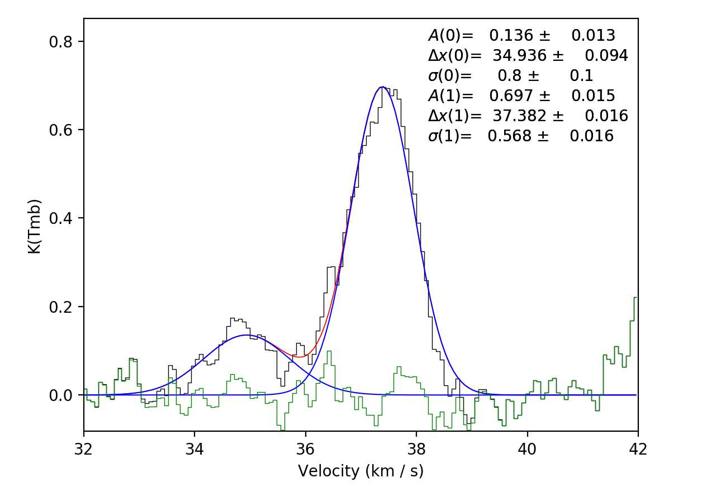
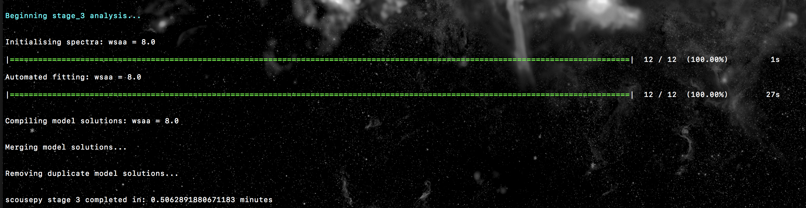

.. _tutorial:

********
Tutorial
********

The aim of this tutorial is to give a basic introduction to the main workflow of
``scousepy``. Each stage will be described below along with some of the
important customisable keywords. All data for the tutorial can be found `here
<https://github.com/jdhenshaw/scousepy_tutorials>`_, along with some example
scripts.

Data
~~~~

This tutorial utilises observations of N2H+ (1-0) towards the Infrared Dark
Cloud G035.39-00.33. This data set was first published in `Henshaw et al. 2013.
<http://adsabs.harvard.edu/abs/2013MNRAS.428.3425H>`_.
These observations were carried out with the IRAM 30m Telescope. IRAM is
supported by INSU/CNRS (France), MPG (Germany) and IGN (Spain). The data file
is in fits format and is called ::

  n2h+10_37.fits

Getting Started
~~~~~~~~~~~~~~~

``scousepy`` requires several key parameters that are worth setting as global
parameters. These can be set in the following way ::

  filename =  'n2h+10_37'
  datadirectory =  './'
  wsaa =  [8.0]

  outputdir = './myoutputdirectory/' # optional
  ppv_vol = [32.0,42.0,None,None,None,None] # optional
  mask_below = 0.3 # optional

Here ``filename`` is provided without the .fits extension. ``datadirectory``
points to the location of the data. By default ``scousepy`` will create a new
directory in the same location as the input file. However, this can be changed
with the optional keyword ``outputdir``. ``wsaa`` is used during stage 1. It
defines the maximum width of the region used to generate spatially averaged
spectra (see below).

The optional keywords listed above include ``ppv_vol``, which allows the user to
control the region of the datacube over which to perform the fitting, and
``mask_below`` which is used to mask the integrated intensity map produced
during stage 1. ``ppv_vol`` is provided as a list and given in the format
``ppv_vol = [min_vel, max_vel, min_y, max_y, min_x, max_x]``.
These are the ranges over which the fitting will be performed. This tutorial
is tuned to the n2h+ data, which has hyperfine structure. Here we implement the
range 32-42 km/s since this allows us to focus on the isolated hyperfine
component, which we model as a Gaussian.

Stage 1
~~~~~~~

As discussed in the :ref:`description <description>` of the code, the purpose
of stage 1 is to identify the spatial area over which to fit the data. Stage 1
requires several key parameters. To run stage 1 you can use ::

  s = scouse.stage_1(filename, datadirectory, wsaa,
                     ppv_vol=ppv_vol,
                     outputdir=outputdir,
                     mask_below=mask_below,
                     fittype='gaussian',
                     verbose = True,
                     write_moments=True,
                     save_fig=True)

Here I've used the keywords ``write_moments=True`` and ``save_fig=True``. The
former will produce FITS files of the zeroth, first, and second order moments of
the data. It will also create a FITS file containing the spectral coordinate of
the maximum value of the spectrum. The latter keyword creates a simple plot of
the coverage that will be used during the fitting procedure. The terminal output
should look something like this...

.. image:: ./stage1.png
  :align: center
  :width: 900

Where it tells us that we will have to fit a total of 12 spatially averaged
spectra and that the total number of spectra to fit is 126. The output coverage
map for this particular tutorial is not much to look at, but here it is anyway...

.. image:: ./n2h+10_37_coverage.png
  :align: center
  :width: 200

Below is a slightly more interesting example where the ``refine_grid`` keyword
has been set. This outputs spectral averaging areas of different sizes. The
basic idea is to reduce the size of the SAAs based on the spectral complexity
in a given location. In this case we define spectral complexity by making a
comparison between the moment 1 map (intensity-weighted average velocity) and
the velocity at peak emission map. In theory, if the spectrum is simple, e.g.
a single Gaussian, the difference between these two values should be close to 0.
On the other hand, if the spectrum is complex then the difference between these
two values is likely to be > 0. Below is the coverage defined for the central
molecular zone cloud G0.253+0.016, and presented in Henshaw et al. 2019. The
SAA sizes decrease from blue - red - yellow, with the yellow regions exhibiting
the most complex line-profiles.

.. image:: ./brick_coverage.png
  :align: center
  :width: 400

Stage 2
~~~~~~~

Stage 2 is where we will perform our manual fitting. It is simple to run using ::

  s = scouse.stage_2(s, verbose=True, write_ascii=True)

where the keyword ``write_ascii`` has been set to output the best-fitting
solutions as an ascii file at the end of the fitting procedure. The fitting
process is based on the interactive process of `pyspeckit
<https://github.com/pyspeckit/pyspeckit>`_. Initialising the fitter will look
a bit like this..

.. image:: ./stage2_1.png
  :align: center
  :width: 900

where we will have an indication of how many spectra we have to fit (and how
many we have already fitted), as well as some important info for the ``pyspeckit``
interactive fitter. Upon running stage 2, a window should have popped up where
one of the spatially averaged spectra will be displayed. Interactive fitting
can be performed using several commands. To indicate components you would like
to fit select each component twice, once somewhere close to the peak emission
and another click to indicate (roughly) the full-width at half-maximum. In my
experience with this, you don't need to be particularly accurate, ``pyspeckit``
does an excellent job of picking up the components you have selected. Selection
can be made either using the keyboard (`m`) or mouse. Once selected this will
look something like this...

.. image:: ./stage2_2.png
  :align: center
  :width: 400

If you are happy with your fit, hitting `d` will lock it in. The resulting
fit will be plotted. At this point ``scousepy`` will output some useful information
to the terminal...

.. image:: ./stage2_3.png
  :align: center
  :width: 900

and will ask if you're happy with the fit. If the fit looks good, press enter
to continue. This will lock the fit in and overplot the individual components...

``scousepy`` will then move onto the next spectrum. If you're not happy with the
fit you can always re-enter the interactive fitter by typing `f`. Repeat this
process until the fitting is completed. Note that as a bit of a time-saver
``scousepy`` will automatically try and fit the each spectrum with the previous
spectrum's best-fitting solution. Often this leads to good fits and its possible
to simply press enter to cycle through a good chunk of the fits. However, this
can also obviously lead to some terrible fits, particularly if there is a big
jump in spatial location and therefore the spectrum changes considerably. If
this happens simply type `f` to re-enter the interactive fitter.

For large datasets its worth noting that there are a couple of keywords here
that might be useful, particularly ``bitesize``. This enables the user to
perform bitesize fitting where the process is broken down into sessions and the
user fits a fixed number of spectra at any one time. The number of spectra to
fit in any one session can be controlled using the ``nspec`` keyword.

Stage 3
~~~~~~~

Stage 3 represents the automated decomposition stage. ``scousepy`` will take you
best-fitting solutions from stage 2 and pass these to the individual spectra
located within each SAA. The fitting process is controlled by a number of
tolerance levels which are passed to ``scousepy`` in the form of a list or an
array ::

  njobs = 4
  tol = [3.0, 2.0, 3.0, 3.0, 0.5]
  s = scouse.stage_3(s, tol, njobs=njobs, verbose=True)

The tolerance levels are descibed more completely in
`Henshaw et al. 2016 <http://adsabs.harvard.edu/abs/2016MNRAS.457.2675H>`_,
however, in short, the first tolerance here is the S/N ratio each component
must satisfy, the second is the minimum width of each component given as a
multiple of the channel spacing, the third and fourth control how similar (in
terms of velocity and width) a component must be to the closest matching component
in the SAA fit, and the final tolerance governs the minimum separation between
two components for them to be considered distinguishable (it is given as a
multiple of the width of the narrowest component).

Something else to consider is the ``njobs`` keyword. The automated fitting procedure
is parallelised. Currently the parallelisation works by sending the fitting of
each SAA to a different node (rather than individual spectra). Perhaps there is
a better way to do this (`suggestions welcome <https://github.com/jdhenshaw/scousepy/pulls>`_),
but it does lead to a bump in speed. I would say however, that in general
I've noticed a considerable reduction in speed in moving from IDL to Python.
This is particularly true in the case of complex data. For the G0.253+0.016 data
in Henshaw+ 2019, for example, 4, 5, 6 component fits are not uncommon. When
the number of components is high, each attempt may take ~ a second. If the fit
is unsatisfactory ``scousepy`` will try a new fit with a different number of
components. When combined with the fact that SAAs are overlapped such that many
of the spectra are fit more than once, it is easy to see how the time begins
to ramp up. As a rule of thumb I'd advise against running this stage on a laptop
in the case of complex data. For the G0.253+0.016 data, I set this running on
~ 20 cores and it crunched away over night. In contrast, running stage 3 on a
similarly sized dataset, but one which is dominated by 1-2 components on roughly
the same number of cores completed in ~ half an hour. So it really depends on
the dataset and the time taken for completion will vary. On a positive note you
can just set it going and leave it to do its thing.

Here is an example of the output to terminal for the tutorial data. In this
case the fitting was not parallelised (``njobs=1``)...

Stage 4
~~~~~~~

Not much to say here - just set this stage running. Here the best-fitting
solutions from stage 3 are compiled for each spectrum. Where the SAAs overlap
there will be multiple fits for each spectrum. Duplicates are removed and the
"best-fit" model solution is defined as that with the smallest AIC value.

  s = scouse.stage_4(s, verbose=True)

Stage 5
~~~~~~~

Now we want to check our work. Stage 5 works interactively and is run in the
following way ::

  s = scouse.stage_5(s, blocksize = 6, figsize = [18,10], plot_residuals=True, verbose=True)

First, a bunch of diagnostic plots will be created (these are all saved to the
stage 5 directory). These include plots of the rms, residuals, reduced chi-squared,
number of components, aic, and the chi-squared. An interactive pop up window
will be displayed which will look something like this...

.. image:: ./stage5_1.png
  :align: center
  :width: 600

This is displaying the rms map. The displayed image can be changed by selecting
a different number. For example, selecting 2 will display the reduced chi-squared...

.. image:: ./stage5_2.png
  :align: center
  :width: 600

By selecting somewhere in the map a new pop up will be displayed. The number of
spectra that will be shown can be defined with the ``blocksize`` keyword. The
pop up window will look something like this...

.. image:: ./stage5_3.png
  :align: center
  :width: 900

The idea behind this stage is to select spectra you may want to take a closer
look at, either because you want to see if an alternative fit is available or
because the fit is bad and you want to re-fit manually. Clicking on a spectrum
will save it for inspection in stage 6. In the below image, I have selected some
of the spectra close to the edge of the map. Clearly here the noise is greater
and the fits aren't as good...

.. image:: ./stage5_4.png
  :align: center
  :width: 900

Note that if you are not happy with any of the spectra in a region you can
select all of them by pressing `a`. If you make a mistake, or would simply like
to remove a spectrum from the selection, hover over the spectrum with the cursor
and press `r` or `d`. Pressing enter on the pop up window with the spectra will
close it and allow you to select another region. A shaded region will show you
where you have already checked...

.. image:: ./stage5_5.png
  :align: center
  :width: 600

For a small dataset like that in the tutorial it is easy to check all spectra.
However, you may want to stick to a representative sample for much bigger datasets.

For my own personal work flow I tend to have a very quick run through stage 5
without actually selecting any spectra. The idea is to have a quick glance at
whether or not the fits are any good. If not, or if I feel I will have to do a
lot of re-fitting (maybe >5-10% of the data), I will stop at this stage and tweak
the parameters of stage 3 and re-run from there. Once I'm happy that the majority
of the fits are reasonable I will go through stage 5 in earnest. 
