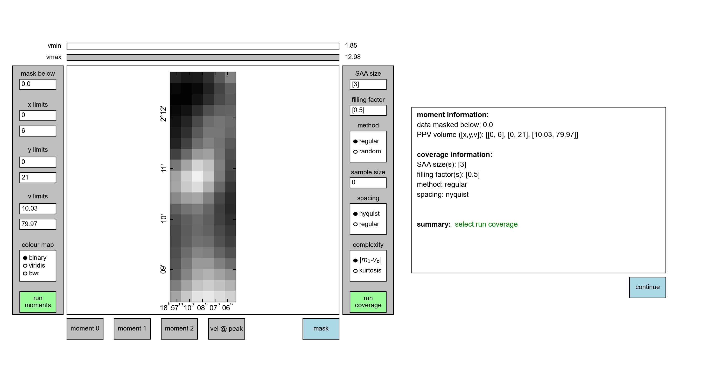
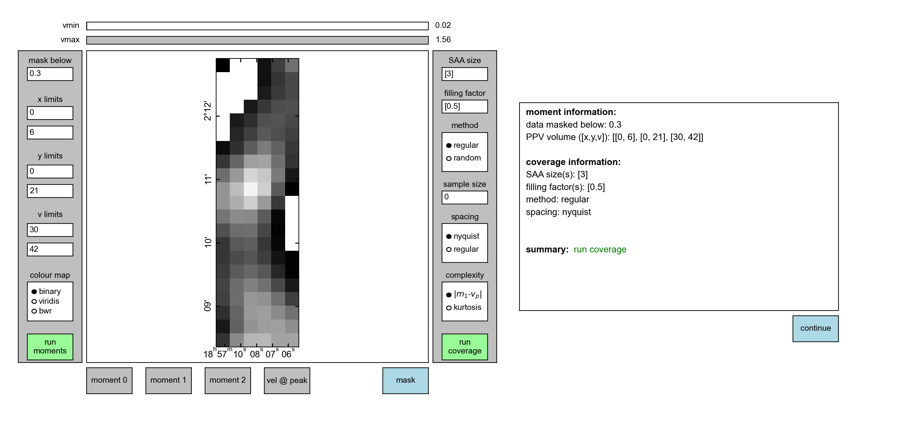
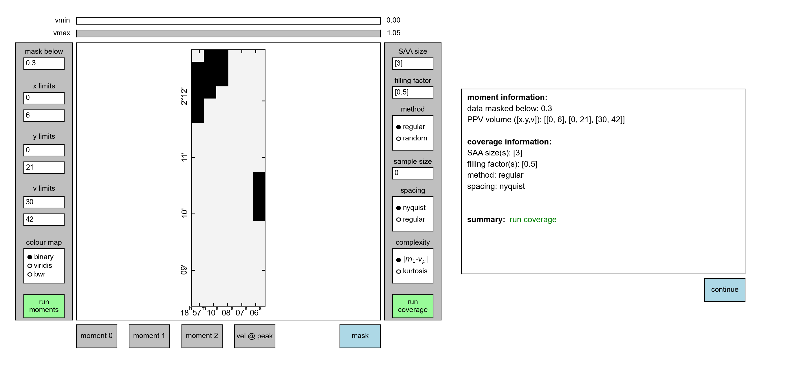
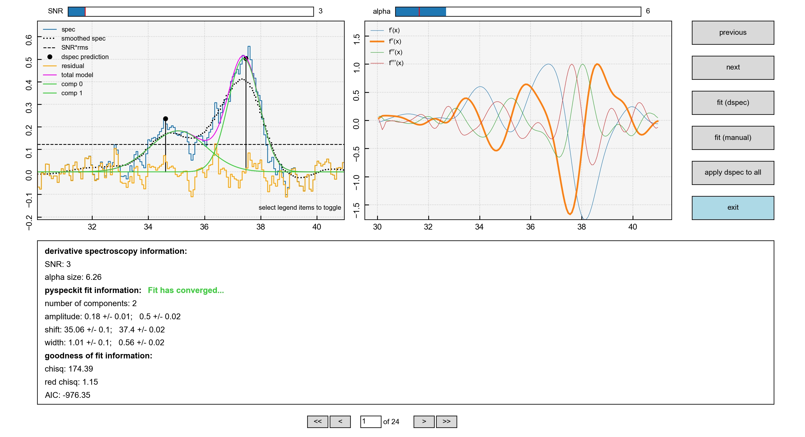
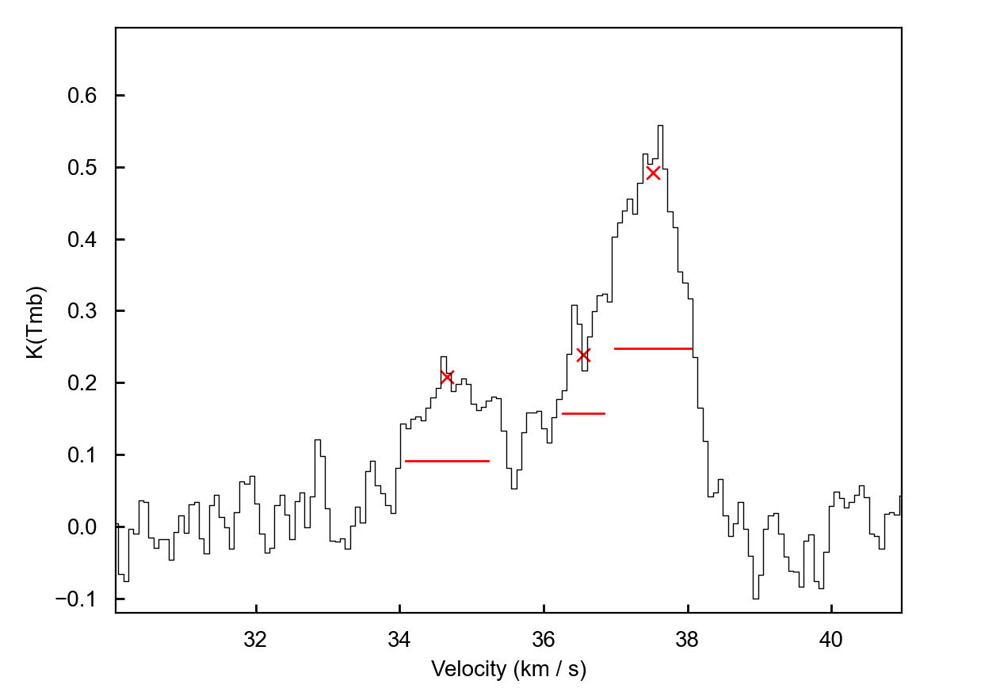
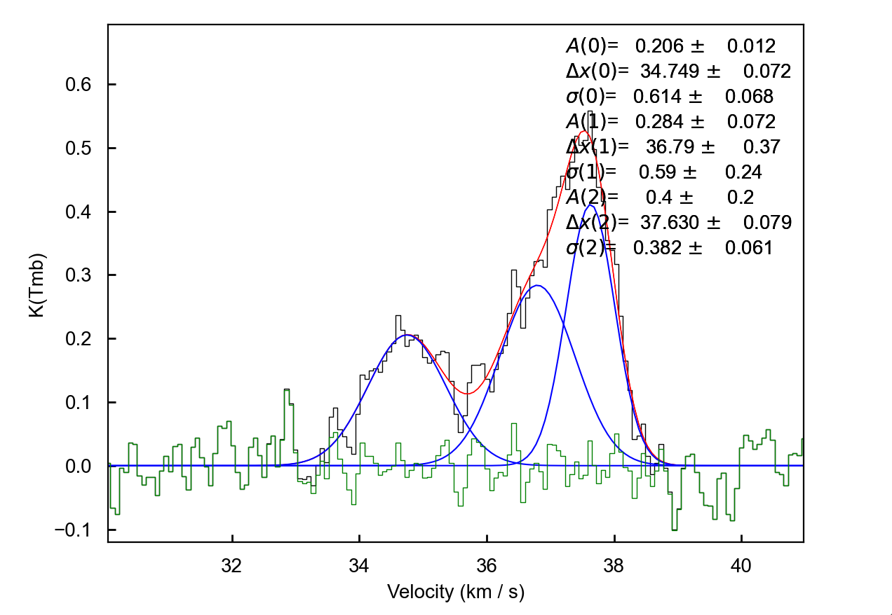
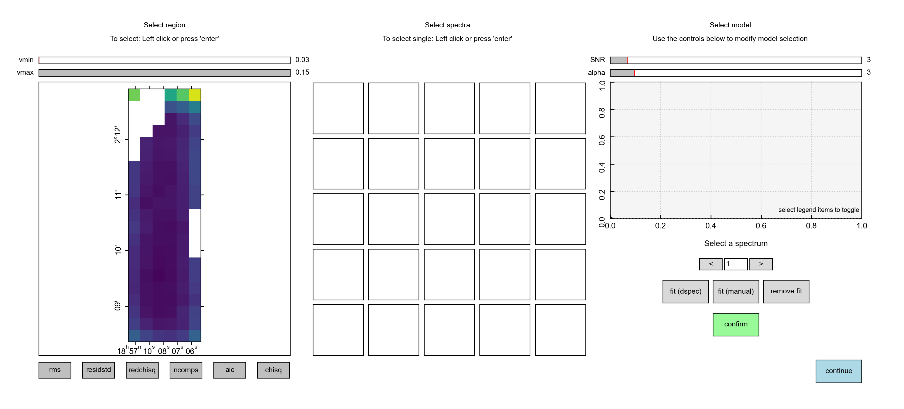
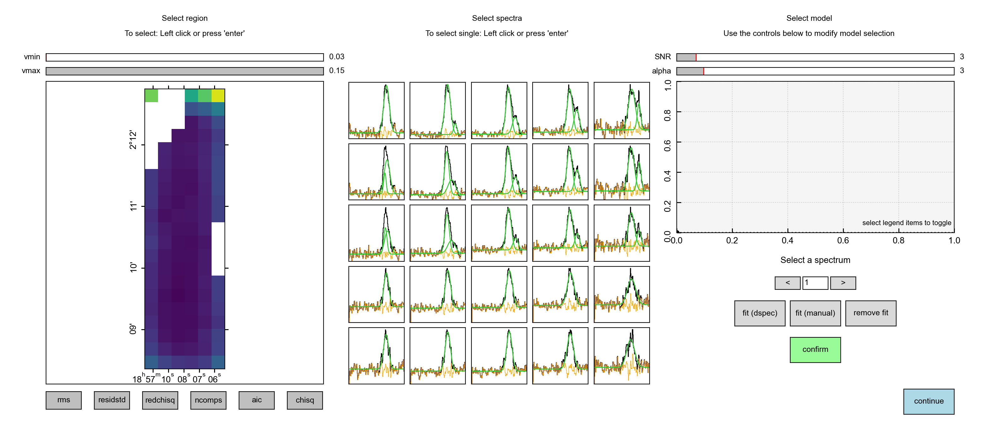
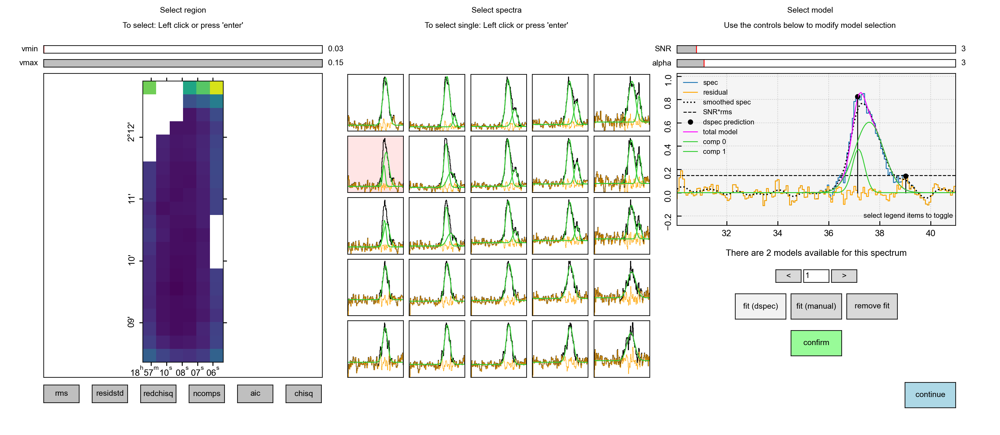
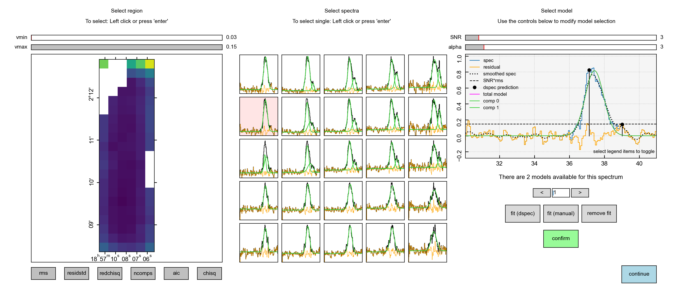

.. _tutorial_v2.0.0:

***************
Tutorial v2.0.0
***************

The aim of this tutorial is to give a basic introduction to the main workflow of
``scousepy``. Each stage will be described below along with some of the
important customisable keywords. All data for the tutorial can be found `here
<https://github.com/jdhenshaw/scousepy_tutorials>`_, along with some example
scripts.

Data
~~~~

This tutorial utilises observations of N2H+ (1-0) towards the Infrared Dark
Cloud G035.39-00.33. This data set was first published in `Henshaw et al. 2013.
<http://adsabs.harvard.edu/abs/2013MNRAS.428.3425H>`_.
These observations were carried out with the IRAM 30m Telescope. IRAM is
supported by INSU/CNRS (France), MPG (Germany) and IGN (Spain). The data file
is in fits format and is called ::

  n2h+10_37.fits

An important note on this data set is that N2H+ (1-0) has hyperfine structure.
For the purposes of this tutorial, we are going to fit only the isolated hyperfine
component. Specific to this data set, this component is located between ~ 30-41 km/s.

Stage 0: preparation step
~~~~~~~~~~~~~~~~~~~~~~~~~

The first thing we are going to do is import ``scousepy`` using ::

  from scousepy import scouse

Next, we want to tell ``scousepy`` where the data is and where to output the
files associated with each stage ::

  datadir='/path/to/the/data/'
  outputdir='/path/to/output/information/'
  filename='n2h+10_37'

Note how the filename is provided without the .fits extension. If `outputdir` is
not provided ``scousepy`` will output everything to `datadir` by default.

Now we are going to create the configuration files ::

  config_file=scouse.run_setup(filename, datadir, outputdir=outputdir)

This will produce a directory with the following structure ::

  | filename
  | ├── config_files
  | │   ├── scousepy.config
  | │   ├── coverage.config
  | ├── stage_1
  | ├── stage_2
  | ├── stage_3
  | └── stage_4

``scousepy.config`` will have the following structure ::

  [DEFAULT]

  # location of the FITS data cube you would like to decompose
  datadirectory = '/path/to/the/data/'

  # name of the FITS data cube (without extension)
  filename = 'n2h+10_37'

  # output directory for data products
  outputdirectory = '/path/to/output/information/'

  # decomposition model (default=Gaussian)
  fittype = 'gaussian'

  # Number of CPUs used for parallel processing
  njobs = 3

  # print messages to the terminal [True/False]
  verbose = True

  # autosave output from individual steps [True/False]
  autosave = True

  [stage_1]

  # save moment maps as FITS files [True/False]
  write_moments = True

  # generate a figure of the coverage map [True/False]
  save_fig = True

  [stage_2]

  # outputs an ascii table of the fits [True/False]
  write_ascii = True

  [stage_3]

  # Tolerance values for the fitting. See Henshaw et al. 2016a
  tol = [2.0,3.0,1.0,2.5,2.5,0.5]

Each of these parameters can be edited directly before running the subsequent
stages. In particular, though ``scousepy`` performs much quicker in parallelised
mode (`njobs`), debugging may be easier in serial.

``coverage.config`` will have the following structure ::

  [DEFAULT]

  # number of refinement steps
  nrefine = 1

  # mask data below this value
  mask_below = 0.0

  # optional input filepath to a fits file containing a mask used to define the coverage
  mask_coverage = None

  # data x range in pixels
  x_range = [None, None]

  # data y range in pixels
  y_range = [None, None]

  # data velocity range in cube units
  vel_range = [None, None]

  # width of the spectral averaging areas
  wsaa = [3]

  # fractional limit below which SAAs are rejected
  fillfactor = [0.5]

  # sample size for randomly selecting SAAs
  samplesize = 0

  # method used to define the coverage [regular/random]
  covmethod = 'regular'

  # method setting spacing of SAAs [nyquist/regular]
  spacing = 'nyquist'

  # method defining spectral complexity
  speccomplexity = 'momdiff'

  # total number of SAAs
  totalsaas = None

  # total number of spectra within the coverage
  totalspec = None

Again, each of these keywords can be edited manually before running stage 1. The
GUI application of stage 1 can be bypassed using the keyword
:code:`interactive=False`. 

Stage 1: defining the coverage - interactive
~~~~~~~~~~~~~~~~~~~~~~~~~~~~~~~~~~~~~~~~~~~~

By default, ``scousepy`` will launch an interactive GUI in order to define the
coverage...

The keywords included in ``coverage.config`` are updated by interacting with the
GUI. For this particular data set we are fitting N2H+ (1-0), so the first thing
we want to do is truncate the velocity range over which we are going to perform
the fitting such that we only focus our attention on the isolated hyperfine
component. We can do this by adjusting the ``v limits`` boxes and clicking
``run moments``. The ``v limits`` are given in absolute units whereas the
``x limits`` and ``y limits`` should be given in pixel units. This will result in
the following

.. image:: ./stage1_GUI_2.png
  :align: center
  :width: 900

Note how although the image itself doesn't change much, the intensity does. This
can be inferred from the sliders at the top of the GUI.

We can also apply a mask such that we only fit a portion of the data. Here I
have used a mask of 0.3 (again in absolute units, in this case K), remembering
to click ``run moments`` again,

We can inspect the mask itself by clicking on the ``mask`` button at the bottom

Next up we want to run the coverage. For this we first want to set the ``SAA size``.
Here I have set the :code:`SAA size=5`. I have also retained the default settings
for the other options, most importantly the :code:`filling factor=0.5`. Clicking
on ``run coverage`` will produce the coverage map.

The remaining settings are best ignored for now, but relate to various pieces of
code that are still in development. The coverage will be displayed on the image
and the box to the right will now display some basic statistics. Most importantly
it indicates how many SAAs are to be fit and how many spectra are included within
those SAAs (and will therefore be fit during stage 3).

Done correctly, you should see something like this

.. image:: ./stage1_GUI_5.png
  :align: center
  :width: 900

Hitting ``continue`` will process the coverage and extract the spatially averaged
spectra from each of the spectral averaging areas

.. image:: ./stage1_GUI_6.png
  :align: center
  :width: 900

Stage 1: defining the coverage - non-interactive
~~~~~~~~~~~~~~~~~~~~~~~~~~~~~~~~~~~~~~~~~~~~~~~~

Note that the ``coverage.config`` file can be edited directly to perform the
computation of the coverage in a non-interactive way. Personally, I have found
this helpful when fitting multiple cubes. In a separate code, I might extract
information on the velocity limits using simple moment analysis. I can then
update the configuration file using something like the following ::

  from scousepy.configmaker import ConfigMaker

  # create a dictionary for updating the scouse config file
  mydicts={'datadirectory': datadir,
          'filename': cubename,
          'outputdirectory': outputdir,
          'njobs': njobs,
          'tol': tol}

  # create a dictionary for updating the coverage config file
  mydictc={'mask_coverage':maskfile,
          'mask_below':snr*rms,
          'vel_range':[velmin.value, velmax.value],
          'wsaa': [wsaa],
          'fillfactor': [fillfactor]}

  ConfigMaker(pathto_scousepyconfig, configtype='init', dict=mydicts)
  ConfigMaker(pathto_coverageconfig, configtype='coverage', dict=mydictc)

Note how you can use a pre-defined mask here as opposed to using the moment
based method used in the interactive version of stage 1. To run stage 1 in this
way use ::

  s = scouse.stage_1(config=config_file, interactive=False)

Stage 2: fitting the spectral averaging areas
~~~~~~~~~~~~~~~~~~~~~~~~~~~~~~~~~~~~~~~~~~~~~

Stage 2 is where we will perform our semi-automated fitting. Running the following
command will initiate a GUI that will allow us to fit the SAA spectra ::

  s = scouse.stage_2(config=config_file)

Where the GUI will look like this

.. image:: ./stage2_GUI_1.png
  :align: center
  :width: 900

The GUI is divided into three main regions (not including the navigation buttons
at the right and bottom of the screen). The top-left displays:

* The spectrum to be fit (blue solid histogram)
* A spectrum that has been smoothed with a Gaussian Kernel of ``width=alpha`` (black dotted curve)
* The initial guesses indicated the location and amplitude of peaks derived from derivative spectroscopy (black lollipops)
* Fitted components (green curves)
* The total model indicating the sum of the individual components (magenta curve)
* The residuals (orange histogram) defined as the spectrum-model

Each of these items can be toggled on/off by clicking on the markers in the legend.

The top-right displays the first (blue), second (orange), third (green), and
fourth (red) order derivatives of the smoothed spectrum displayed in the left-hand
plot. The profiles of these curves are used to identify peaks in the data.

The bottom panel displays the fit information extracted from ``pyspeckit``. First
it tells us that the fit has converged. It tells us the number of fitted components
and their Gaussian characteristics (amplitude, shift=centroid, and width) and
uncertainties. It also shows us some goodness of fit statistics.

The fitting is controlled via the ``alpha`` and ``SNR`` parameters. As an example
increasing the ``alpha`` value, which has the effect of smoothing the spectrum
even more would result in a fewer number of components, as is illustrated here

Note the difference in the right-hand panel, where now there are two prominent
dips in the second derivative (orange) indicating the location of peaks.

If you are unable to find a suitable fit by adjusting the ``SNR`` and ``alpha``
sliders, the other option is to enter the manual fitter which can be found in the
navigation bar on the right. This will open up ``pyspeckit``'s manual fitter
and should look like this

.. image:: ./stage2_GUI_3.png
  :align: center
  :width: 500

Interactive fitting can be performed using several commands. To indicate
the components that you would like to fit, you select each component twice: once
somewhere close to the peak emission and another click to indicate (roughly)
the full-width at half-maximum. In my experience with this, you don't need to
be particularly accurate, ``pyspeckit`` does an excellent job of picking up the
components you have selected. Selection can be made either using the keyboard
(`m`) or mouse. Once selected this will look something like this...

If you are happy with your fit, hitting `d` will lock it in. The resulting
fit will be plotted and some useful information will be printed out to the
terminal.

Hitting `enter` will close the interactive window and the fit in ``scousepy``'s
stage 2 GUI will update.

You can then navigate to the next spectra either by using the navigation bar on
the right (``previous``, ``next``) or the buttons at the bottom. Note that if at
any time you exit the fitter, and re-run the script, ``scousepy`` will pick up
where it left off.

Finally, when checking the results of the automated fitting in stage 3 and 4, it
may become clear that some tweaks are needed to the fitting. Using the keyword
:code:`refit` will allow you to re-enter the fitter ::

  s = scouse.stage_2(config=config_file, refit=True)

You can then navigate to problematic spectra using the input field at the bottom
of the GUI.

Stage 3: automated fitting
~~~~~~~~~~~~~~~~~~~~~~~~~~

Stage 3 represents the automated decomposition stage. ``scousepy`` will take you
best-fitting solutions from stage 2 and pass these to the individual spectra
located within each SAA. The fitting process is controlled by a number of
tolerance levels which are passed to ``scousepy`` via the ``tol`` keyword in
``scousepy.config``.

The tolerance levels are descibed more completely in
`Henshaw et al. 2016 <http://adsabs.harvard.edu/abs/2016MNRAS.457.2675H>`_.
However, in short, the tolerance levels correspond to the following

1. The allowed change in the number of components between the fit of an individual
   spectrum and its parent SAA.
2. The S/N ratio each component must satisfy.
3. The minimum width of each component given as a multiple of the channel spacing.
4. This controls how similar a component must be to the closest matching component
   in the SAA fit in terms of velocity dispersion.
5. This controls how similar a component must be to the closest matching component
   in the SAA fit in terms of centroid velocity.
6. This governs the minimum separation between two components for them to be
   considered distinguishable (it is given as a multiple of the width of the
   narrowest component).

Stage 3 is run using the following command ::

  s = scouse.stage_3(config=config_file)

with the progress report output to terminal

.. image:: ./stage3_v2_1.png
  :align: center
  :width: 900

The Nyquist sampling of the SAAs means that a given spectrum may have multiple
solutions. ``scousepy`` identifies the best-fitting solution via the Akaike
Information Criterion (AIC). The AIC is a measure of relative fitting quality
which is used for fitting evaluation and model selection. The decision is in
favour of the model with the lowest AIC. The AIC is given

.. math::

  \mathrm{AIC}=2(k-L)

in which :math:`k` is the number of free parameters, and :math:`L` is the log
likelihood function of the model evaluated at the maximum likelihood estimate
(i. e., the parameters for which L is maximized). More generally, ``scousepy``
computes the AIC assuming that the observations are Gaussian distributed such
that

.. math::

  \mathrm{AIC}=n\,\mathrm{ln}\bigg(\frac{SSR}{n}\bigg)+2k

in which :math:`SSR` is the sum of the squared residuals and :math:`n` is the
sample size. In the event that the sample size is not large enough :math:`n<40`,
a correction is applied

.. math::

  \mathrm{AIC}=n\,\mathrm{ln}\bigg(\frac{SSR}{n}\bigg)+2k+\frac{2k(k+1)}{n-k-1}.

The computation is handled via `astropy <https://docs.astropy.org/en/stable/api/astropy.stats.akaike_info_criterion_lsq.html>`_.

To select the best-fitting solution, ``scousepy`` uses the following rule of
thumb from Burnham and Anderson 2002, pg. 70:

.. math::

  \Delta \mathrm{AIC}_{i}=\mathrm{AIC}_{i}-\mathrm{AIC}_{min}

.. math::

  \Delta \mathrm{AIC}_{i}<2\;\mathrm{substantial\;support\;for\;model}\;i

.. math::

  4<\Delta \mathrm{AIC}_{i}<7\;\mathrm{considerably\;less\;support\;for\;model}\;i

.. math::

  \Delta \mathrm{AIC}_{i}>10\;\mathrm{essentially\;no\;support\;for\;model}\;i

where :math:`\mathrm{AIC}_{min}` is the minimum :math:`\mathrm{AIC}` value out of
the models compared.

Something to consider is the ``njobs`` keyword. Various stages of ``scousepy``
have been parallelised. The parallelisation works on a divide and conquer
approach, whereby the total number of spectra to be fit are divided into batches
and each batch sent to a different cpu. I would highly recommend using ``njobs>1``
for large (>10000 spectra) data sets or for data sets with large numbers of
components.

Stage 4: quality control
~~~~~~~~~~~~~~~~~~~~~~~~

Stage 4 represents the quality control phase. Here we are able to inspect the
decomposition. Stage 4 is run using the following command ::

  s = scouse.stage_4(config=config_file)

This command will launch a GUI with which we can inspect the best-fitting
solutions determined during stage 3. The GUI will look like the following

The GUI is divided into three main areas. The left panel displays a series of
diagnostic plots that can be used to identify problem areas. The diagnostic plots
include

1. rms noise.
2. standard deviation of the residual spectrum at each pixel
3. reduced :math:`\chi^{2}`
4. number of fitted components
5. AIC - the Akaike Information Criterion
6. :math:`\chi^{2}`

Selecting a pixel in the diagnostic map will display the spectrum and its best-fitting
solution at that location (as well as its surrounding neighbours) in the central
panel like so

The user can then select one of the highlighted spectra for closer inspection.
By clicking on one of the spectra in the central panel, it will appear in the
right-hand panel. Underneath the spectrum will include some additional information
on the decomposition. In the example below, we can see that there are two models
available. The model selected (and displayed) by ``scousepy`` is a two component
model.

However, the user has the option to edit this. Pressing on the right arrow will
display the next available solution, in this case, a single component fit. If
the user would like to use this solution instead, they can click ``confirm``.
Note how this automatically updates the spectrum model in the central panel.

Alternatively, the user can manually fit the spectrum, either using derivative
spectroscopy ``fit (dspec)`` or manually using ``fit (manual)``, which will launch
``pyspeckit``'s manual fitter. Again, to lock the change in, the user must hit
``confirm`` before selecting another spectrum.

The user can end the process by hitting ``continue``. If at any stage the user
would like to re-enter this quality control step, they can do so by using the
keyword `bitesize` ::

  s = scouse.stage_4(config=config_file, bitesize=True)

Note that the user can also bypass this step entirely by using the keyword `nocheck` ::

  s = scouse.stage_4(config=config_file, nocheck=True)

A complete example
~~~~~~~~~~~~~~~~~~

To run all the steps in sequence your code might look something like this ::

  # import scousepy
  from scousepy import scouse

  # create pointers to input, output, data
  datadir='/path/to/the/data/'
  outputdir='/path/to/output/information/'
  filename='n2h+10_37'

  # run scousepy
  config_file=scouse.run_setup(filename, datadirectory, outputdir=outputdir)
  s = scouse.stage_1(config=config_file, interactive=True)
  s = scouse.stage_2(config=config_file)
  s = scouse.stage_3(config=config_file)
  s = scouse.stage_4(config=config_file, bitesize=True)
